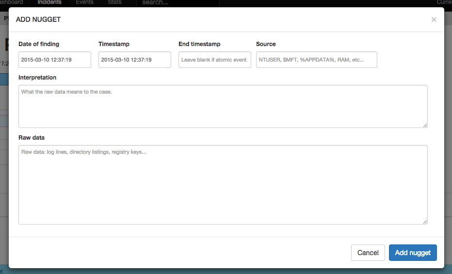

## Install

Follow the generic plugin installation instructions in [the FIR wiki](https://github.com/certsocietegenerale/FIR/wiki/Plugins).

## Usage

The `fir_nuggets` plugin allows you to build a forensic investigation timeline within an incident. It should be used as a replacement for your usual note-taking app when carrying out a forensic investigation. Of course, by **nugget** we mean **gold** and not **chicken**.
Nuggets are displayed in the **incident followup** in `timestamp` (see below) chronological order. You can add nuggets in any order you want, and the investigation or attack timeline will be automatically created for you.

A nugget is basically an artifact or anything noteworthy that could be found during an investigation. To add a nugget to an incident, just click on `Add` then on `Nugget`. You will be presented with the following form:

* `Date of finding` - This should be left alone; it's just there to timestamp the date on which the nugget was added
* `Timestamp` *(optional)* - This is the artifact's most representative timestamp (for example, the creation date of a Zbot directory in %APPDATA%).
* `End timestamp` *(optional)* - Use this field with the `timestamp` field to indicate an event that happens over an extended period of time. For example, the creation date of the last Zbot directory in %APPDATA%, if there are multiple infections.
* `Interpretation` - What the raw data means. For example, "lots of Zbot infections between `timestamp` and `end timestamp`".
* `Raw data` - This is meant to contain the output of the tool that was used to deduce the `Interpretation`. To follow our Zbot example, it could be a `fls` or other timeline output. Any artifacts added in the `raw data` section will be processed and added to the incident. See the `fir_artifacts` plugin for more details.
* If `Timestamp` and `End timestamp` are both left blank, the nugget will be added as a "general remark". This is useful for findings that are not particularly time-bound. For example "Weak password for administrator account".

## Development

Everything you need to tweak the plugin is in the `fir_nuggets` directory: static files (JavaScript & CSS), templates, and actions (in `views.py`)

TODO: Attach file to nuggets?
